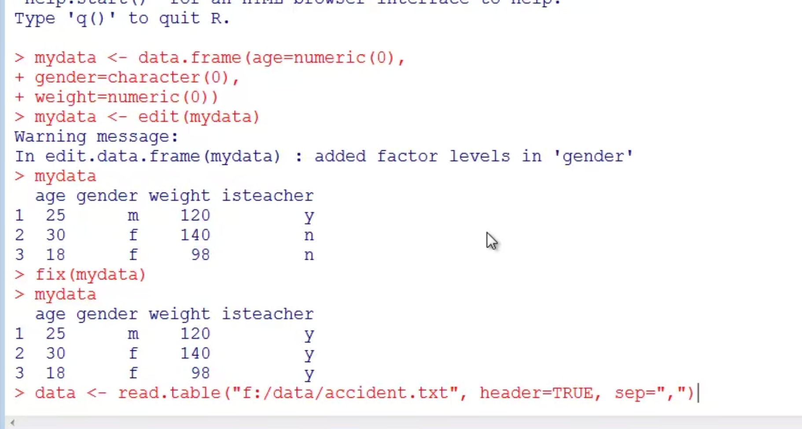

# 1.安装包

.liPaths() 能够显示库的所在位置

library() 能够显示库中有哪些包

search() 可以告诉你那些包加载可以使用


包的使用

install.packages("gclus")   下载安装包

update.packages() 更新已近安装的包

installed.packages() 列出安装的包


可以使用library()这个命令载入这个包，列入 library(gclus)即可使用gclus包，在一次会话中看，包只载入一次。


**帮助**


命令： 

help()


# 2.数据结构

向量、矩阵、数组、数据框、列表


### 向量

向量（Vector）在 Java、Rust、C# 这些专门编程的的语言的标准库里往往会提供，这是因为向量在数学运算中是不可或缺的工具——我们最常见的向量是二维向量，这种向量在平面坐标系中必然会用到。

向量从数据结构上看就是一个线性表，可以看成一个数组。

```R
> a = c(3, 4)
> b = c(5, 0)
> a + b
[1] 8 4


> a = c(10, 20, 30, 40, 50)
> a[2]
[1] 20

> a[1:4] # 取出第 1 到 4 项，包含第 1 和第 4 项
[1] 10 20 30 40
> a[c(1, 3, 5)] # 取出第 1, 3, 5 项
[1] 10 30 50
> a[c(-1, -5)] # 去掉第 1 和第 5 项
[1] 20 30 40	

这三种部分取出方法是最常用的。
向量支持标量计算：
> c(1.1, 1.2, 1.3) - 0.5
[1] 0.6 0.7 0.8
> a = c(1,2)
> a ^ 2
[1] 1 4


之前讲述的常用的数学运算函数，如 sqrt 、exp 等，同样可以用于对向量作标量运算。
"向量"作为线性表结构，应该具备一些常用的线性表处理函数，R 确实具备这些函数：

> a = c(1, 3, 5, 2, 4, 6)
> sort(a)
[1] 1 2 3 4 5 6
> rev(a)
[1] 6 4 2 5 3 1
> order(a)
[1] 1 4 2 5 3 6
> a[order(a)]
[1] 1 2 3 4 5 6

```


R 中有十分完整的统计学函数：

| **函数名** | **含义**                             |
| :--------- | :----------------------------------- |
| sum        | 求和                                 |
| mean       | 求平均值                             |
| var        | 方差                                 |
| sd         | 标准差                               |
| min        | 最小值                               |
| max        | 最大值                               |
| range      | 取值范围（二维向量，最大值和最小值） |

**向量生成**


向量的生成可以用 **c()** 函数生成，也可以用 min:max 运算符生成连续的序列。


如果想生成有间隙的等差数列，可以用 seq 函数：

```
> seq(1, 9, 2)
[1] 1 3 5 7 9
```

seq 还可以生成从 m 到 n 的等差数列，只需要指定 m, n 以及数列的长度：

```
> seq(0, 1, length.out=3)
[1] 0.0 0.5 1.0
```

rep 是 repeat（重复）的意思，可以用于产生重复出现的数字序列：

```
> rep(0, 5)
[1] 0 0 0 0 0
```

向量中常会用到 NA 和 NULL ，这里介绍一下这两个词语与区别：

- NA 代表的是"缺失"，NULL 代表的是"不存在"。
- NA 缺失就像占位符，代表这里没有一个值，但位置存在。
- NULL 代表的就是数据不存在。

实例说明：

```R
\> **length**(**c**(NA, NA, NULL))
[1] 2
\> **c**(NA, NA, NULL, NA)
[1] NA NA NA
```

很显然， NULL 在向量中没有任何意义。


​	


### 矩阵

R 语言为线性代数的研究提供了矩阵类型，这种数据结构很类似于其它语言中的二维数组，但 R 提供了语言级的矩阵运算支持。

矩阵里的元素可以是数字、符号或数学式。

一个 **M x N** 的矩阵是一个由 **M（row） 行** 和 **N 列（column）**元素排列成的矩形阵列。

```R
matrix(data = NA, nrow = 1, ncol = 1, byrow = FALSE,dimnames = NULL)
```

**参数说明：**

- **data** 向量，矩阵的数据
- **nrow** 行数
- **ncol** 列数
- **byrow** 逻辑值，为 FALSE 按列排列，为 TRUE 按行排列
- **dimname** 设置行和列的名称


```R
# byrow 为 TRUE 元素按行排列
M <- matrix(c(3:14), nrow = 4, byrow = TRUE)
print(M)

# Ebyrow 为 FALSE 元素按列排列
N <- matrix(c(3:14), nrow = 4, byrow = FALSE)
print(N)

# 定义行和列的名称
rownames = c("row1", "row2", "row3", "row4")
colnames = c("col1", "col2", "col3")

P <- matrix(c(3:14), nrow = 4, byrow = TRUE, dimnames = list(rownames, colnames))
print(P)


执行以上代码输出结果为：

[,1] [,2] [,3]
[1,]    3    4    5
[2,]    6    7    8
[3,]    9   10   11
[4,]   12   13   14
     [,1] [,2] [,3]
[1,]    3    7   11
[2,]    4    8   12
[3,]    5    9   13
[4,]    6   10   14
     col1 col2 col3
row1    3    4    5
row2    6    7    8
row3    9   10   11
row4   12   13   14
```


**转置矩阵**

R 语言矩阵提供了 **t()** 函数，可以实现矩阵的行列互换。

例如有个 m 行 n 列的矩阵，使用 t() 函数就能转换为 n 行 m 列的矩阵。


```R
\# 创建一个 2 行 3 列的矩阵
M = **matrix**( **c**(2,6,5,1,10,4), **nrow** = 2,**ncol** = 3,byrow = TRUE)
**print**(M)
   [,1] [,2] [,3]
[1,]   2   6   5
[2,]   1  10   4
\# 转换为 3 行 2 列的矩阵
**print**(**t**(M))


执行以上代码输出结果为：


     [,1] [,2] [,3]
[1,]    2    6    5
[2,]    1   10    4
[1] "-----转换-----"
     [,1] [,2]
[1,]    2    1
[2,]    6   10
[3,]    5    4
```


**访问矩阵元素**

如果想获取矩阵元素，可以通过使用元素的列索引和行索引，类似坐标形式。


```R
# 定义行和列的名称
rownames = c("row1", "row2", "row3", "row4")
colnames = c("col1", "col2", "col3")

# 创建矩阵
P <- matrix(c(3:14), nrow = 4, byrow = TRUE, dimnames = list(rownames, colnames))
print(P)
# 获取第一行第三列的元素
print(P[1,3])

# 获取第四行第二列的元素
print(P[4,2])

# 获取第二行
print(P[2,])

# 获取第三列
print(P[,3])
```


**矩阵计算**

大小相同（行数列数都相同）的矩阵之间可以相互加减，具体是对每个位置上的元素做加减法。矩阵的乘法则较为复杂。两个矩阵可以相乘，当且仅当第一个矩阵的列数等于第二个矩阵的行数。

**矩阵加减法**

**实例**

\# 创建 2 行 3 列的矩阵
matrix1 <- **matrix**(**c**(7, 9, -1, 4, 2, 3), **nrow** = 2)
**print**(matrix1)

matrix2 <- **matrix**(**c**(6, 1, 0, 9, 3, 2), **nrow** = 2)
**print**(matrix2)

\# 两个矩阵相加
result <- matrix1 + matrix2
**cat**("相加结果：","**\n**")
**print**(result)

\# 两个矩阵相减
result <- matrix1 - matrix2
**cat**("相减结果：","**\n**")
**print**(result)

执行以上代码输出结果为：

```
[,1] [,2] [,3]
[1,]    7   -1    2
[2,]    9    4    3
     [,1] [,2] [,3]
[1,]    6    0    3
[2,]    1    9    2
相加结果： 
     [,1] [,2] [,3]
[1,]   13   -1    5
[2,]   10   13    5
相减结果： 
     [,1] [,2] [,3]
[1,]    1   -1   -1
[2,]    8   -5    1
```

**矩阵乘除法**

**实例**

\# 创建 2 行 3 列的矩阵

```R
matrix1 <- **matrix**(**c**(7, 9, -1, 4, 2, 3), **nrow** = 2)
**print**(matrix1)

matrix2 <- **matrix**(**c**(6, 1, 0, 9, 3, 2), **nrow** = 2)
**print**(matrix2)

\# 两个矩阵相乘
result <- matrix1 * matrix2
**cat**("相乘结果：","**\n**")
**print**(result)

\# 两个矩阵相除
result <- matrix1 / matrix2
**cat**("相除结果：","**\n**")
**print**(result)
```

执行以上代码输出结果为：

```
[,1] [,2] [,3]
[1,]    7   -1    2
[2,]    9    4    3
     [,1] [,2] [,3]
[1,]    6    0    3
[2,]    1    9    2
相乘结果： 
     [,1] [,2] [,3]
[1,]   42    0    6
[2,]    9   36    6
相除结果： 
         [,1]      [,2]      [,3]
[1,] 1.166667      -Inf 0.6666667
[2,] 9.000000 0.4444444 1.5000000
```


### 数组

数组也是 R 语言的对象，R 语言可以创建一维或多维数组。

R 语言数组是一个同一类型的集合，前面我们学的矩阵 matrix 其实就是一个二维数组。

向量、矩阵、数组关系可以看下图：


R 语言数组创建使用 array() 函数，该函数使用向量作为输入参数，可以使用 dim 设置数组维度。

array() 函数语法格式如下：

```R
array(data = NA, dim = length(data), dimnames = NULL)
```

**参数说明：**

- data 向量，数组元素。
- dim 数组的维度，默认是一维数组。
- dimnames 维度的名称，必须是个列表，默认情况下是不设置名称的。

```R
# 创建两个不同长度的向量
vector1 <- c(5,9,3)
vector2 <- c(10,11,12,13,14,15)

# 创建数组
result <- array(c(vector1,vector2),dim = c(3,3,2))
print(result)
```


执行以上代码输出结果为：

```
, , 1

     [,1] [,2] [,3]
[1,]    5   10   13
[2,]    9   11   14
[3,]    3   12   15

, , 2

     [,1] [,2] [,3]
[1,]    5   10   13
[2,]    9   11   14
[3,]    3   12   15

[1] 56 68 60
```


案例

```r
> dim1<-c("A1","A2","A3")
> dim2<-c("B1","B2")
> dim3<-c("C1","C2","C3","C4")
> d<-array(1:24,c(3,2,4),dimnames = list(dim1,dim2,dim3))
> d
, , C1

   B1 B2
A1  1  4
A2  2  5
A3  3  6

, , C2

   B1 B2
A1  7 10
A2  8 11
A3  9 12

, , C3

   B1 B2
A1 13 16
A2 14 17
A3 15 18

, , C4

   B1 B2
A1 19 22
A2 20 23
A3 21 24

```


使用 dimnames 参数来设置各个维度的名称：：

```r
# 创建两个不同长度的向量
vector1 <- c(5,9,3)
vector2 <- c(10,11,12,13,14,15)
column.names <- c("COL1","COL2","COL3")
row.names <- c("ROW1","ROW2","ROW3")
matrix.names <- c("Matrix1","Matrix2")

# 创建数组，并设置各个维度的名称
result <- array(c(vector1,vector2),dim = c(3,3,2),dimnames = list(row.names,column.names,matrix.names))
print(result)
```

执行以上代码输出结果为：

```R
, , Matrix1

     COL1 COL2 COL3
ROW1    5   10   13
ROW2    9   11   14
ROW3    3   12   15

, , Matrix2

     COL1 COL2 COL3
ROW1    5   10   13
ROW2    9   11   14
ROW3    3   12   15

```

**访问数组元素**

如果想获取数组元素，可以通过使用元素的列索引和行索引，类似坐标形式。

```
# 创建两个不同长度的向量
vector1 <- c(5,9,3)
vector2 <- c(10,11,12,13,14,15)
column.names <- c("COL1","COL2","COL3")
row.names <- c("ROW1","ROW2","ROW3")
matrix.names <- c("Matrix1","Matrix2")

# 创建数组
result <- array(c(vector1,vector2),dim = c(3,3,2),dimnames = list(row.names, column.names, matrix.names))

# 显示数组第二个矩阵中第三行的元素
print(result[3,,2])

# 显示数组第一个矩阵中第一行第三列的元素
print(result[1,3,1])

# 输出第二个矩阵
print(result[,,2])
```

执行以上代码输出结果为：

```
COL1 COL2 COL3 
   3   12   15 
[1] 13
     COL1 COL2 COL3
ROW1    5   10   13
ROW2    9   11   14
ROW3    3   12   15
```

**操作数组元素**

由于数组是由多个维度的矩阵组成，所以我们可以通过访问矩阵的元素来访问数组元素。

```
# 创建两个不同长度的向量
vector1 <- c(5,9,3)
vector2 <- c(10,11,12,13,14,15)

# 创建数组
array1 <- array(c(vector1,vector2),dim = c(3,3,2))

# 创建两个不同长度的向量
vector3 <- c(9,1,0)
vector4 <- c(6,0,11,3,14,1,2,6,9)
array2 <- array(c(vector1,vector2),dim = c(3,3,2))

# 从数组中创建矩阵
matrix1 <- array1[,,2]
matrix2 <- array2[,,2]

# 矩阵相加
result <- matrix1+matrix2
print(result)
```

执行以上代码输出结果为：

```
     [,1] [,2] [,3]
[1,]   10   20   26
[2,]   18   22   28
[3,]    6   24   30
```

另外我们可以使用 **apply()** 元素对数组元素进行跨维度计算，语法格式如下：

```
apply(x, margin, fun)
```

参数说明：

- **x** 数组
- **margin** 数据名称
- **fun** 计算函数

以下我们使用 apply() 函数来计算数组两个矩阵中每一行对数字之和。

**实例**

\# 创建两个不同长度的向量

```
vector1 <- **c**(5,9,3)
vector2 <- **c**(10,11,12,13,14,15)

\# 创建数组
new.array <- **array**(**c**(vector1,vector2),**dim** = **c**(3,3,2))
**print**(new.array)

\# 计算数组中所有矩阵第一行的数字之和
result <- **apply**(new.array, **c**(1), **sum**)
**print**(result)
```

执行以上代码输出结果为：

```
, , 1

     [,1] [,2] [,3]
[1,]    5   10   13
[2,]    9   11   14
[3,]    3   12   15

, , 2

     [,1] [,2] [,3]
[1,]    5   10   13
[2,]    9   11   14
[3,]    3   12   15

[1] 56 68 60
```


### 数据框

数据框（Data frame）可以理解成我们常说的"表格"。

数据框是 R 语言的数据结构，是特殊的二维列表。

数据框每一列都有一个唯一的列名，长度都是相等的，同一列的数据类型需要一致，不同列的数据类型可以不一样。

R 语言数据框使用 data.frame() 函数来创建，语法格式如下：

```
data.frame(…, row.names = NULL, check.rows = FALSE,
           check.names = TRUE, fix.empty.names = TRUE,
           stringsAsFactors = default.stringsAsFactors())
```

- **…**: 列向量，可以是任何类型（字符型、数值型、逻辑型），一般以 tag = value 的形式表示，也可以是 value。
- **row.names**: 行名，默认为 NULL，可以设置为单个数字、字符串或字符串和数字的向量。
- **check.rows**: 检测行的名称和长度是否一致。
- **check.names**: 检测数据框的变量名是否合法。
- **fix.empty.names**: 设置未命名的参数是否自动设置名字。
- **stringsAsFactors**: 布尔值，字符是否转换为因子，factory-fresh 的默认值是 TRUE，可以通过设置选项（stringsAsFactors=FALSE）来修改。

```
table = data.frame(
  姓名 = c("张三", "李四"),
  工号 = c("001","002"),
  月薪 = c(1000, 2000)
  
)
```

使用attach函数获取数据框数据

把数据库加入attach中就可以直接输入列明获取列数据


detach将数据库在attach中移除


或者用with来获取


但是命令只能在with的花括号里面执行才能生效


**print**(**table**) # 查看 table 数据

执行以上代码输出结果为：

```
姓名 工号 月薪
1 张三  001 1000
2 李四  002 2000
```


数据框的数据结构可以通过 **str()** 函数来展示：

```
table = data.frame(
    姓名 = c("张三", "李四"),
    工号 = c("001","002"),
    月薪 = c(1000, 2000)
)
# 获取数据结构
str(table)


'data.frame':   2 obs. of  3 variables:
 $ 姓名: chr  "张三" "李四"
 $ 工号: chr  "001" "002"
 $ 月薪: num  1000 2000
```


**summary()** 可以显示数据框的概要信息：

```R
table = data.frame(
    姓名 = c("张三", "李四"),
    工号 = c("001","002"),
    月薪 = c(1000, 2000)
   
)
# 显示概要
print(summary(table))  


执行以上代码输出结果为：

姓名               工号                月薪     
Length:2           Length:2           Min.   :1000  
Class :character   Class :character   1st Qu.:1250  
Mode  :character   Mode  :character   Median :1500  
                                      Mean   :1500  
                                      3rd Qu.:1750  
                                      Max.   :2000  
```


我们也可以提取指定的列：

```r
table = data.frame(
    姓名 = c("张三", "李四"),
    工号 = c("001","002"),
    月薪 = c(1000, 2000)
)
# 提取指定的列
result <- data.frame(table$姓名,table$月薪)
print(result)


table.姓名 table.月薪
1       张三       1000
2       李四       2000
```


```R
table = data.frame(
    姓名 = c("张三", "李四","王五"),
    工号 = c("001","002","003"),
    月薪 = c(1000, 2000,3000)
)
print(table)
# 提取前面两行
print("---输出前面两行----")
result <- table[1:2,]
print(result)


姓名 工号 月薪
1 张三  001 1000
2 李四  002 2000
3 王五  003 3000
[1] "---输出前面两行----"
  姓名 工号 月薪
1 张三  001 1000
2 李四  002 2000
```


```R
table = data.frame(
    姓名 = c("张三", "李四","王五"),
    工号 = c("001","002","003"),
    月薪 = c(1000, 2000,3000)
)
# 读取第 2 、3 行的第 1 、2 列数据：
result <- table[c(2,3),c(1,2)]
print(result)

# 执行以上代码输出结果为：

姓名 工号
2 李四  002
3 王五  003
```

**扩展数据框**

我们可以对已有的数据框进行扩展，以下实例我们添加部门列：

```R
table = data.frame(
    姓名 = c("张三", "李四","王五"),
    工号 = c("001","002","003"),
    月薪 = c(1000, 2000,3000)
)
# 添加部门列
table$部门 <- c("运营","技术","编辑")

print(table)


# 执行以上代码输出结果为：
姓名 工号 月薪 部门
1 张三  001 1000 运营
2 李四  002 2000 技术
3 王五  003 3000 编辑
```


我们可以使用 **cbind()** 函数将多个向量合成一个数据框：

```R
# 创建向量
sites <- c("Google","Runoob","Taobao")
likes <- c(222,111,123)
url <- c("www.google.com","www.runoob.com","www.taobao.com")

# 将向量组合成数据框
addresses <- cbind(sites,likes,url)

# 查看数据框
print(addresses)


# 执行以上代码输出结果为：
     sites    likes url             
[1,] "Google" "222" "www.google.com"
[2,] "Runoob" "111" "www.runoob.com"
[3,] "Taobao" "123" "www.taobao.com"
```

如果要对两个数据框进行合并可以使用 **rbind()** 函数：

```r
table = data.frame(
    姓名 = c("张三", "李四","王五"),
    工号 = c("001","002","003"),
    月薪 = c(1000, 2000,3000)
)
newtable = data.frame(
    姓名 = c("小明", "小白"),
    工号 = c("101","102"),
    月薪 = c(5000, 7000)
)
# 合并两个数据框
result <- rbind(table,newtable)
print(result)


姓名 工号 月薪
1 张三  001 1000
2 李四  002 2000
3 王五  003 3000
4 小明  101 5000
5 小白  102 7000
```


### 列表

列表是 R 语言的对象集合，可以用来保存不同类型的数据，可以是数字、字符串、向量、另一个列表等，当然还可以包含矩阵和函数。

R 语言创建列表使用 **list()** 函数。

如下实例，我们创建一个列表，包含了字符串、向量和数字：

```R
list_data <- list("runoob", "google", c(11,22,33), 123, 51.23, 119.1)
print(list_data)


# 执行以上代码输出结果为

[[1]]
[1] "runoob"

[[2]]
[1] "google"

[[3]]
[1] 11 22 33

[[4]]
[1] 123

[[5]]
[1] 51.23

[[6]]
[1] 119.1
```

我们可以使用 **names()** 函数给列表的元素命名：

```R
# 列表包含向量、矩阵、列表
list_data <- list(c("Google","Runoob","Taobao"), matrix(c(1,2,3,4,5,6), nrow = 2),
   list("runoob",12.3))

# 给列表元素设置名字
names(list_data) <- c("Sites", "Numbers", "Lists")

# 显示列表
print(list_data)

# 执行以上代码输出结果为
$Sites
[1] "Google" "Runoob" "Taobao"

$Numbers
     [,1] [,2] [,3]
[1,]    1    3    5
[2,]    2    4    6

$Lists
$Lists[[1]]
[1] "runoob"

$Lists[[2]]
[1] 12.3
```

**操作列表元素**

我们可以对列表进行添加、删除、更新的操作，如下实例：

```r
# 列表包含向量、矩阵、列表
list_data <- list(c("Google","Runoob","Taobao"), matrix(c(1,2,3,4,5,6), nrow = 2),
   list("runoob",12.3))

# 给列表元素设置名字
names(list_data) <- c("Sites", "Numbers", "Lists")

# 添加元素
list_data[4] <- "新元素"
print(list_data[4])

# 删除元素
list_data[4] <- NULL
#或者
list_data<-list_data(-4)

# 删除后输出为 NULL
print(list_data[4])

# 更新元素
list_data[3] <- "我替换来第三个元素"
print(list_data[3])

# 执行以上代码输出结果为
[[1]]
[1] "新元素"

$<NA>
NULL

$Lists
[1] "我替换来第三个元素"
```

**合并列表**

我们可以使用 **c()** 函数将多个列表合并为一个列表：

\# 创建两个列表

```R
list1 <- **list**(1,2,3)
list2 <- **list**("Google","Runoob","Taobao")

\# 合并列表
merged.list <- **c**(list1,list2)

\# 显示合并后的列表
**print**(merged.list)
```

执行以上代码输出结果为：

```
[[1]]
[1] 1

[[2]]
[1] 2

[[3]]
[1] 3

[[4]]
[1] "Google"

[[5]]
[1] "Runoob"

[[6]]
[1] "Taobao"
```

**列表转换为向量**

要将列表转换为向量可以使用 **unlist()** 函数，将列表转换为向量，可以方便我们进行算术运算：


\# 创建列表

```R
list1 <- **list**(1:5)
**print**(list1)

list2 <-**list**(10:14)
**print**(list2)

\# 转换为向量
v1 <- **unlist**(list1)
v2 <- **unlist**(list2)

**print**(v1)
**print**(v2)

\# 两个向量相加
result <- v1+v2
**print**(result)
```

执行以上代码输出结果为：

```
[[1]]
[1] 1 2 3 4 5

[[1]]
[1] 10 11 12 13 14

[1] 1 2 3 4 5
[1] 10 11 12 13 14
[1] 11 13 15 17 19
```


# 3.常用函数

head() 显示前面6条数据

ls() 查看内存中的对象

rm(xxx) 删除内存中的对象 

length() 查看向量的长度

mode(xx) 查看向量的数据类型

rnorm() 生成随机数

​           列： rnorm(10)    

 					rnorm(6,mean=6,sd=2) 6个数均值是6，标准差2

不想取向量x的某个值，比如不想取第五个，x[-5]。不想取1到3的值 x[-(1:3)]


# 数据源导入

使用edit和fix数据编辑器，操作数据框

```R
mydata<-data.frame(age=numeric(0),gender=character(0),weight=numeric(0))

mydata<-edit(mydata)
```

​	


使用read.table()读取txt文件

head： 将第一行为名称

sep： 分割符





使用read.csv()读取txt和csv文件


# 5.自定义函数

```R
> mydata<-function(type){
+     switch(type,
+            long = format(Sys.time(),"%A %B %d"),
+            short=format(Sys.time(),"%a-%d-%y"),
+            cat(type,"is not recognized type\n")
+     )
+ }
> mydata("short")
[1] "Tue-06-22"
```


# 6.连接mysql

安装

```R
install.packages("RMariaDB", repos = "https://mirrors.ustc.edu.cn/CRAN/")

```


```R
> mysqlconnection = dbConnect(MariaDB(), user = 'root', password = '12345678', dbname = 'cp',host = 'localhost')
> dbListTables(mysqlconnection)

```


或者

```r
> library(DBI)
> library(RMySQL)
> mysqlconnection = dbConnect(MySQL(), user = 'root', password = '12345678', dbname = 'cp',host = 'localhost')
> dbListTables(mysqlconnection)
> library(RMySQL)
> result <- dbSendQuery(mysqlconnection, "select * from sys_user")
> data.frame = fetch(result, n = 2)
> print(data.frame)
```


