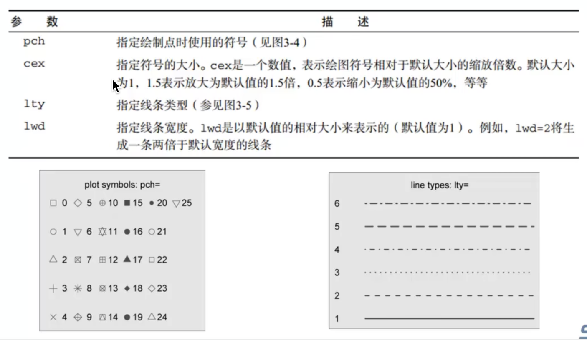
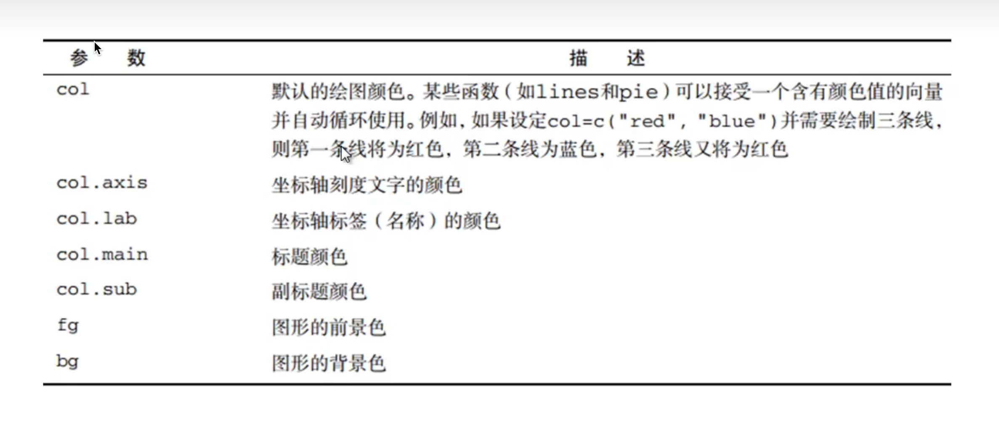
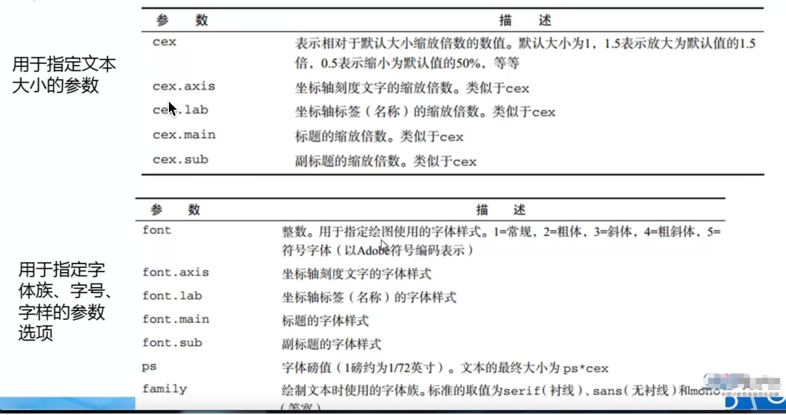
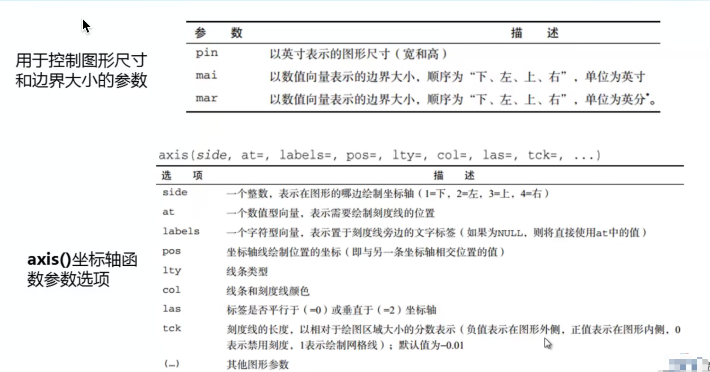
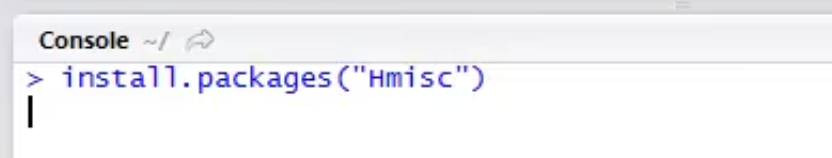
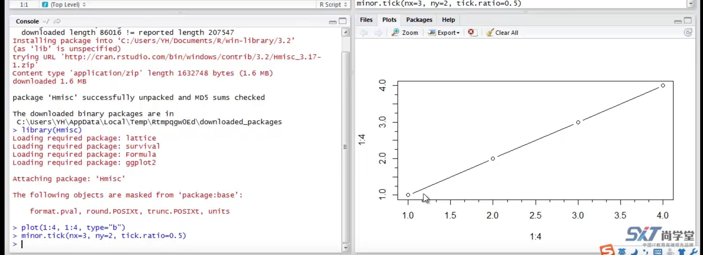
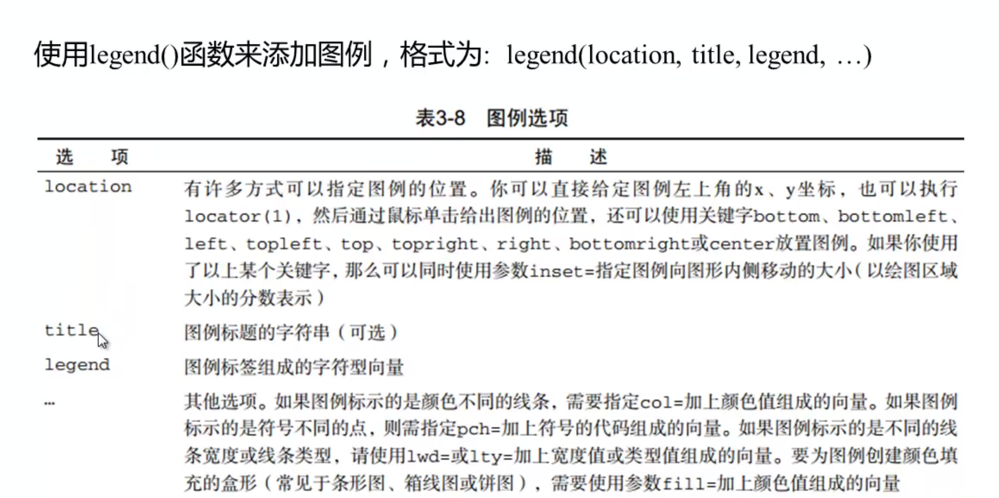
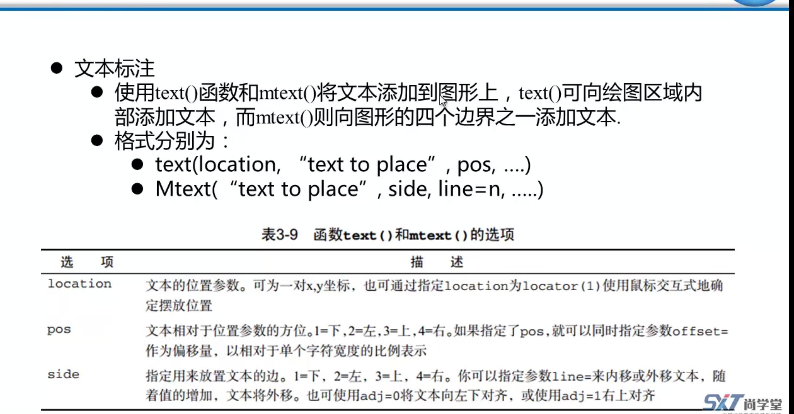
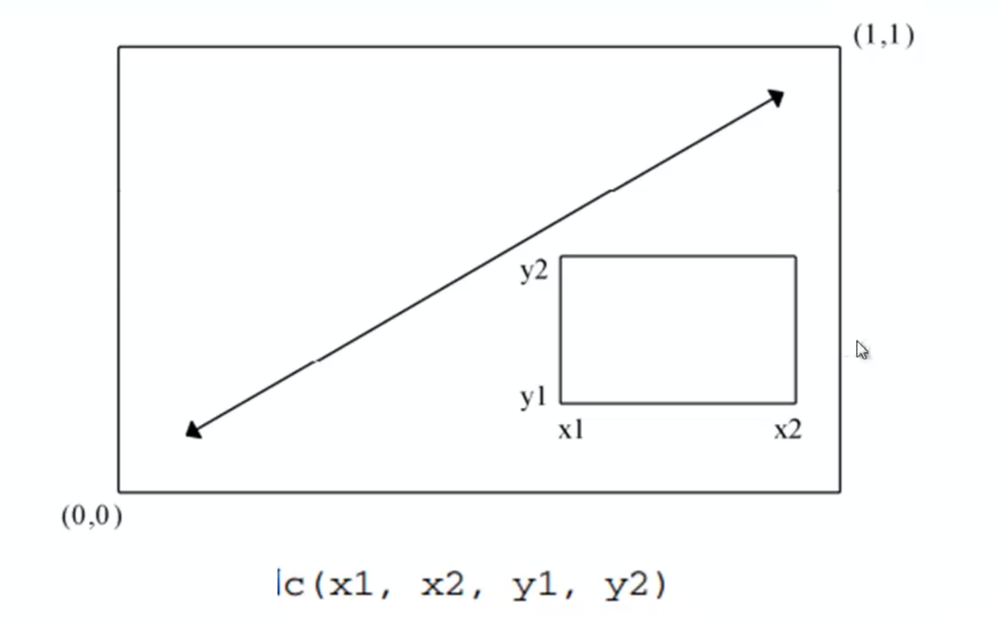

# 1.画图

### 1.**图形参数、符号、线条和颜色**





**plot 函数**

```R
dose<-c(20,30,40,45,60)
drugA<-c(16,20,27,40,60)
drugB<-c(15,18,25,31,40)
plot(dose,drugA,type="b")

```

type=''b" 表示同事绘制点和线条


**par函数**

```R
opar<-par(no.readonly = TRUE)
par(lty=2,pch=17)
plot(dose,drugA,type = "b")

# 或者
plot(dose,drugA,type = "b",lty=2,pch=19)

```


```R
plot(dose,drugA,type = "b",lty=6,lwd=3,pch=11,cex=3)
```


### 2.**文本属性、图形、边界尺寸、添加标题、自定义坐标轴**






```R
# 查看可用字体
names(pdfFonts())
```


如果设置的值就是0.1 可以不写0直接写 .1

```R
opar<-par(no.readonly = TRUE)
par(pin=c(2,3))
par(lwd=2,cex=1.5)
par(cex.axis=0.75,font.axis=3)
plot(dose,drugA,type = "b",pch=19,lty=2,col="red")
plot(dose,drugA,type = "b",pch=23,lty=2,col="blue",bg="green")

```


**添加标题、自定义坐标轴**


```R
# **添加标题、自定义坐标轴**
par(family='STXihei') # 加入中文字体，防止乱码
plot(dose,drugA,type="b",col="red",lty=2,pch=2,lwd=2,main = "药物A的反应曲线",
     sub = "则是一个测试数据",xlab = "测量",ylab = "病人反应",xlim = c(0,60))


```


### 次要刻度线、参考线、图例、文本标注

### 刻度线

次要刻度线需要下载包 使用minor.tick函数







参考线

使用abline()函数

```
# 参考线 使用abline()函数
abline(h=2,col="red",lty=2)
abline(v=2,col="blue",lty=2)
```


图例：




```R
# 图列 
dose<-c(20,30,40,45,60)
drugA<-c(16,20,27,40,60)
drugB<-c(15,18,25,31,40)
opar<- par(no.readonly = TRUE)
par(lwd=2,cex=1.5,font.lab=2)
plot(dose,drugA,type = "b",pch=15,lty=1,col="red",ylim=c(0,60),
     main = "药物A和药物B的对比",xlab = "剂量",ylab = "药物反应")
lines(dose,drugB,type = "b",pch=17,lty=2,col="blue")
minor.tick(nx=5,ny=2,tick.ratio=,5)
legend("topleft",inset = 0.05,title="类型",legend = c("A","B"),lty=c(1,2),
       pch = c(15,17),col = c("red","blue"))
```


### 文本标注




```R
# 文本标注
attach(mtcars)
head(mtcars)
opar<- par(no.readonly = TRUE)
par(lwd=2,cex=1.5,font.lab=2)
plot(wt,mpg,main = "车重和耗油",xlab = "车重",ylab = "耗油量",pch=18,col="blue")
text(wt,mpg,row.names(mtcars),cex=0.5,pos=4,col = "red")

```


# 图形组合和图形布局的精细控制

R如何画图
  -- 图形组合
    - par() 函数的mfrow参数
        - layout()函数
    -- 图形布局的精细控制
        - par() 函数的fig参数


```R
#  图形组合和图形布局的精细控制
attach(mtcars)
opar<-par(no.readonly = TRUE)
par(mfrow=c(2,2)) # mfrow=c(2,2)  几行几列
plot(wt,mpg,main ="wt vs mpg")
plot(wt,disp,main = "wt vs disp")
hist(wt,main = "Histogram of wt")
boxplot(wt,main="Boxplot of wt")
par(opar)
detach(mtcars)

```


```R
attach(mtcars)
opar<-par(no.readonly = TRUE)
par(mfrow=c(3,1))
hist(wt)
hist(mpg)
hist(disp)
par(opar)
detach(mtcars)
```


```R
# layout 使用 和 通过widths和weights 控制画布大小
attach(mtcars)
layout(matrix(c(1,1,2,3),2,2,byrow = TRUE))
hist(wt)
hist(mpg)
hist(disp)

layout(matrix(c(1,1,2,3),2,2,byrow = TRUE),widths = c(2,1),heights = c(1,1))
hist(wt)
hist(mpg)
hist(disp)
```


### 图形布局的精细布置

fig函数



```R

# fig函数
attach(mtcars)
opar<-par(no.readonly = TRUE)
par(fig=c(0,0.8,0,0.8))
plot(wt,mpg,xlab = "Gallon",ylab = "weight")

par(fig(0.65,1,0,0.8))
boxplot(mpg,axes=FALSE)


par(fig=c(0,0.8,0,0.8))
plot(wt,mpg,xlab = "Gallon",ylab = "weight")
par(fig=c(0.55,1,0,0.8),new=TRUE)  # new=TRUE两个图就不相互覆盖
boxplot(mpg,axes=FALSE)
par(fig=c(0,0.8,0.55,1),new=TRUE)
boxplot(wt,horizontal = TRUE,axes=FALSE)
```


