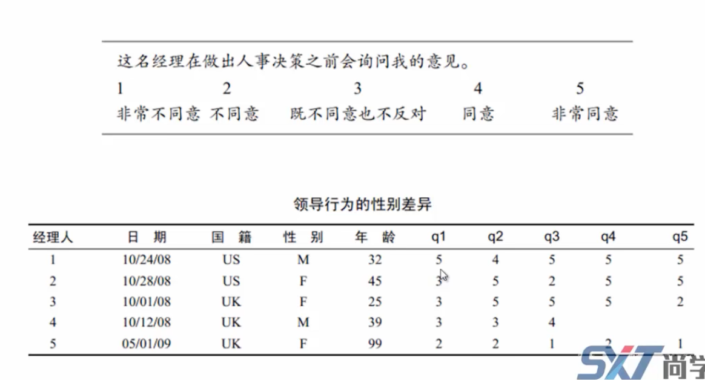
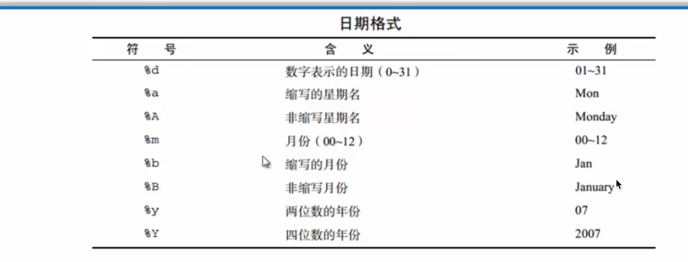
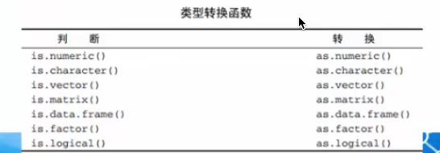
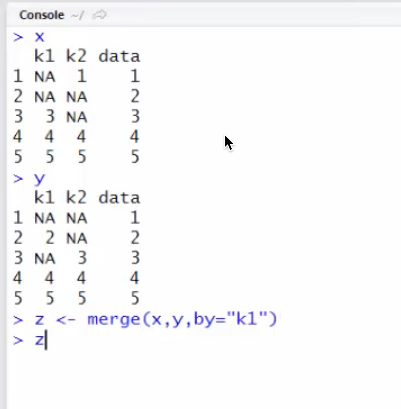
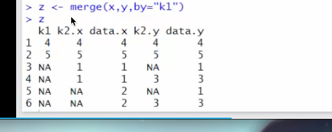
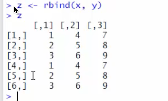

# 数据管理

## 创建变量、变量重编码、重命名




新建测试数据

```R
manager<-c(1,2,3,4,5)
date<-c("10/24/08","10/28/08","10/1/08","10/12/08","5/1/09")
country<-c("US","US","UK","UK","UK")
gender<-c("M","F","F","M","F")
age<-c(32,45,25,39,99)
q1<-c(5,3,3,3,2)
q2<-c(4,5,5,3,2)
q3<-c(5,2,5,3,2)
q4<-c(5,5,5,NA,2)
q5<-c(5,5,2,NA,1)
survey<-data.frame(manager,date,country,gender,age,q1,q2,q3,q4,q5,stringsAsFactors = FALSE)

```


把99岁的赋值为空


```R
# 把99岁的赋值为空
survey$age[survey$age==99]<-NA
```


方口号里面可以添加条件，他会自动遍历数据筛选

```R
survey$age[survey$age>75]<-"老年人"
survey$age[survey$age>55 & survey$age<75]<-"中年人"
survey$age[survey$age<55]<-"青年人"
survey
```


### 更改变量名


```R
# 查看变量名和修改变量名
names(survey)

names(survey)[6]<- "question1"
survey
```


## 如何处理缺失值、日期值使用、数据类型判断和转换、数据排序

### 缺失值

NA 一般使用NA表示

```R
> x<-c(1,2,3,NA)
> is.na(x)

[1] FALSE FALSE FALSE  TRUE
```


有空值的时候运算结果都是空

```R
x<-c(1,2,NA,4)
y<-x[1]+x[2]+x[3]+x[4]
y
```


去空

```R
y<-sum(x,na.rm = TRUE)
y

```


na.omit() 函数，删除有空值的那一行

```R
survey
data<- na.omit(survey)
data
```


### 日期 

as.Date()函数



```R
mydate<-as.Date("2016-01-20")
mydate
mydate1<-c("01/05/2006","01/29/2007")
mydate1
date<-as.Date(mydate1,"%m/%d/%Y")
date
```


系统时间

```R
> Sys.Date()
[1] "2022-12-08"
> date()
[1] "Thu Dec  8 20:10:22 2022"
```


format()格式化，还能做时间运算

```R
# format()格式化，
today<-Sys.Date()
today
format(today,format="%B  %d %Y")

format(today,format="%y")

startdate<-as.Date("2003-01-23")
enddate<-as.Date("2001-09-18")
days<-enddate-startdate
days
```


### 类型转换




```R
a<-c(2,4)
is.numeric(a)

```


### 排序

order() 默认升序

```r
# 排序
data<-survey[order(survey$age)]
data

data<-survey[order(survey$age),]  # 不加逗号就是按列排序
data

data1<-survey[order(survey$gender,survey$age)]
data1
```


# 数据集的合并、数据集取子集、随机抽样函数

cbind()函数 列合并

```R
# 数据集的合并
x<- matrix(c(1,2,3,4,5,6,7,8,9),nrow=3,ncol=3)
x
y<-x
y
z<-cbind(x,y)
z
```


rbind函数，行合并；注意需要有相同的列数列变量才行

```R
# rbind函数，行合并；注意需要有相同的列数列变量才行
x<- matrix(c(1,2,3,4,5,6,7,8,9),nrow=3,ncol=3)
x
y<-x
y
z<-rbind(x,y)
z

```


merge() 函数 内连接，如下指定根据k1来内连接











## 数据集取子集

筛选值，和不选哪些值

```
> survey
  manager     date country gender    age question1 q2 q3 q4 q5
1       1 10/24/08      US      M 青年人         5  4  5  5  5
2       2 10/28/08      US      F 青年人         3  5  2  5  5
3       3  10/1/08      UK      F 青年人         3  5  5  5  2
4       4 10/12/08      UK      M 青年人         3  3  3 NA NA
5       5   5/1/09      UK      F 老年人         2  2  2  2  1
> q<-survey[,6:10]
> q
  question1 q2 q3 q4 q5
1         5  4  5  5  5
2         3  5  2  5  5
3         3  5  5  5  2
4         3  3  3 NA NA
5         2  2  2  2  1
> x<-survey[,-2] # 删除第二列
> x
  manager country gender    age question1 q2 q3 q4 q5
1       1      US      M 青年人         5  4  5  5  5
2       2      US      F 青年人         3  5  2  5  5
3       3      UK      F 青年人         3  5  5  5  2
4       4      UK      M 青年人         3  3  3 NA NA
5       5      UK      F 老年人         2  2  2  2  1
> x<-survey[-1,] # 删除第二列
> x
  manager     date country gender    age question1 q2 q3 q4 q5
2       2 10/28/08      US      F 青年人         3  5  2  5  5
3       3  10/1/08      UK      F 青年人         3  5  5  5  2
4       4 10/12/08      UK      M 青年人         3  3  3 NA NA
5       5   5/1/09      UK      F 老年人         2  2  2  2  1
```


使用subset() 函数

```R
# 使用subset() 函数
survey
newdata<-subset(survey,q2>3|q1<5,select = c(q1,q2,q3,q4))
newdata
```


## 随机抽样函数

使用sample() 函数

smaple(x,size,replace=FALSE)

x 数据集  size 范围  replace 等于false就是随机数没有重复的，不放回的

```R
> mysample<-  survey[sample(5,3,replace = FALSE)]
> mysample
  gender     date country
1      M 10/24/08      US
2      F 10/28/08      US
3      F  10/1/08      UK
4      M 10/12/08      UK
5      F   5/1/09      UK
> # 使用sample() 函数
> mysample<-  survey[sample(5,3,replace = FALSE)]
> mysample
     age     date manager
1 青年人 10/24/08       1
2 青年人 10/28/08       2
3 青年人  10/1/08       3
4 青年人 10/12/08       4
5 老年人   5/1/09       5
> mysample<-  survey[sample(5,3,replace = FALSE)]
> mysample
  country manager     date
1      US       1 10/24/08
2      US       2 10/28/08
3      UK       3  10/1/08
4      UK       4 10/12/08
5      UK       5   5/1/09
```


