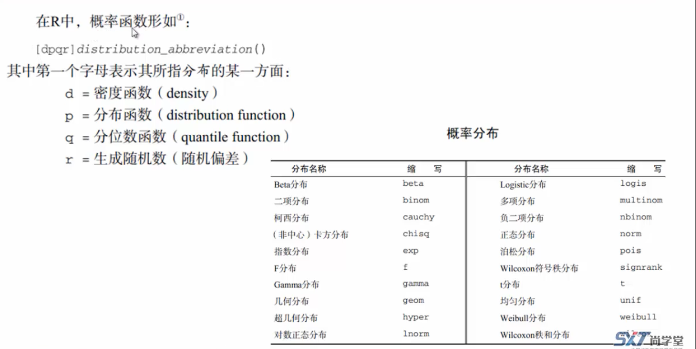

# 数学函数、统计函数、概率函数

## 数学函数

abs() 求绝对值

sqrt() 平方根

ceiling() 向上取整

floor()  向下取整

round()

sin()

cos()


## 统计函数

mean() 平均值

sum() 

sd() 标准差

var() 方差

max() 最大值

min() 最小值

scale() 标准化

```R
> x<-1
> x
[1] 1
> scale(x)
     [,1]
[1,]  NaN
attr(,"scaled:center")
[1] 1
attr(,"scaled:scale")
[1] 0
```


## 概率函数




pretty()

计算一个约n+1个等间距的“圆”值序列，这些值覆盖x中的值的范围。这些值被选择为1、2或5乘以10的幂。

dnorm()

Density, distribution function, quantile function and random generation for the normal distribution with mean equal to `mean` and standard deviation equal to `sd`.


```R
x<-pretty(c(-3,3),30)
x
y<-dnorm(x)
plot(x,y)
# 待了解 pnorm qnorm rnorm
```


rnorm() 随机函数

```R
> rnorm(50,mean=50,sd=8) # mean 均值 sd 标准差
 [1] 56.05341 56.55383 47.98017 52.39794 46.11029 54.18668 63.75339 43.85464 45.39019 44.59823
[11] 54.19257 50.10733 47.64264 39.51231 46.71321 55.80665 42.73486 51.77431 41.19451 44.97846
[21] 50.64657 42.15876 69.53700 55.45084 39.23670 49.84412 44.67578 23.24798 48.99207 43.12605
[31] 65.28956 50.01047 52.15153 65.18926 42.50685 58.05690 33.16008 54.68542 53.72026 56.89993
[41] 57.33989 47.86280 59.23143 48.18598 44.66075 58.96168 38.71629 58.60757 51.75166 58.97337
```


runif() 随机函数

```
runif(5)
[1] 0.2881516 0.2771616 0.9599493 0.5246841 0.9334367
```


set.seed() 函数 显示指定的种子，runif()随机的数就是一样的了

```R
> set.seed(12)
> runif(5)
[1] 0.06936092 0.81777520 0.94262173 0.26938188 0.16934812
> set.seed(12)
> runif(5)
[1] 0.06936092 0.81777520 0.94262173 0.26938188 0.16934812
```


# 字符处理函数、其他实用函数、将函数应用于矩阵和数据框

## 字符处理函数

nchar() 统计字符串字符数量

substr() 截取字符串

grep() 查询位置

strsplit() 在指定标识分割

paste() 合并字符串

toupper() 转大写

tolower() 转小写

```
> substr("abcde",3,5)
[1] "cde"
> grep("a",c("a","b","a"))
[1] 1 3
```


## 其他实用函数

lenght()

seq() 生成等差数列

rep() 重复数据

cat() 打印数据


## 将函数应用于矩阵和数据框

```R
> # 将函数应用于矩阵和数据框
> b<-matrix(runif(12),nrow = 3)
> b
           [,1]        [,2]      [,3]      [,4]
[1,] 0.03389562 0.022877743 0.8138806 0.2649184
[2,] 0.17878500 0.008324827 0.3762485 0.4393343
[3,] 0.64166537 0.392697197 0.3808122 0.4576072
> log(b) # log() 求对数值
           [,1]       [,2]       [,3]       [,4]
[1,] -3.3844694 -3.7775907 -0.2059417 -1.3283335
[2,] -1.7215713 -4.7885131 -0.9775056 -0.8224946
[3,] -0.4436883 -0.9347165 -0.9654490 -0.7817442
> mean(b)
[1] 0.3342539
```


apply() 函数

apply(c,1,mean) 对向量按行求平均值，如果是2，就是按列求平均值

```R
> # apply() 函数
> c<-matrix(rnorm(30),nrow=6)
> c
           [,1]        [,2]        [,3]       [,4]       [,5]
[1,]  0.5295228 -1.27146664  0.99880466 -1.3829321  0.4078134
[2,]  0.8985920 -1.01775514  1.08264643  0.2177133  0.3993719
[3,]  1.1640443 -0.34129457  0.60551959  0.3879403  0.1739130
[4,] -0.6974244 -0.01217949 -0.85864687  1.4383541 -0.7909530
[5,] -0.6367779 -0.32726726 -0.00471031  1.1956177 -0.9397014
[6,]  1.1642682 -0.40234274 -0.55315942  1.5731952  1.2238650
> apply(c,1,mean)
[1] -0.1436516  0.3161137  0.3980245 -0.1841699 -0.1425679  0.6011652
> apply(c, 2,mean)
[1]  0.40370415 -0.56205097  0.21174235  0.57164807  0.07905146
```


还有lapply() 和 sapply


# 重复和循环、条件执行、转置

## 重复和循环

```R
# 重复和循环、条件执行、转置
x<-10;
while (x>0) {
  print("hello");
  x<-x-1
}

# for 
for (i in 1:5) {
   print("hello")  
}

```


## 条件执行

**if-else ifelse switch**

```R
x<--1
if(x!=1) print("male")
if(x!=1) print("male") else print("female")

ifelse(x>1,print("male"),print("female"))


```


**switch 语句**

一个 switch 语句允许测试一个变量等于多个值时的情况。每个值称为一个 case。

语法格式如下：

```
switch(expression, case1, case2, case3....)
```

**switch** 语句必须遵循下面的规则：

- **switch** 语句中的 **expression** 是一个常量表达式，可以是整数或字符串，如果是整数则返回对应的 case 位置值，如果整数不在位置的范围内则返回 NULL。
- 如果匹配到多个值则返回第一个。
- **expression**如果是字符串，则对应的是 case 中的变量名对应的值，没有匹配则没有返回值。
- switch 没有默认参数可用。

以下实例返回第三个值：

**实例**

```R
x <- switch(
  3,
  "google",
  "runoob",
  "taobao",
  "weibo"
)
print(x)
```

执行以上代码，输出结果为：

```
[1] "taobao"
```

如果是字符串返回字符串变量对应的值：

**实例**

```R
you.like<-"runoob"
switch(you.like, google="www.google.com", runoob = "www.runoob.com", taobao = "www.taobao.com")
```

执行以上代码，输出结果为：

```
[1] "www.runoob.com"
```

如果整数不在范围内的则返回 NULL

**实例**

```R
# 没有key的时候返回null
x <- switch(4,"google","runoob","taobao")
x
```


## 转置

t() 函数

```r
> car<-matrix(1:3,1:4)
> car
     [,1] [,2] [,3]
[1,]    1    2    3
> t(car)
     [,1]
[1,]    1
[2,]    2
[3,]    3
```


