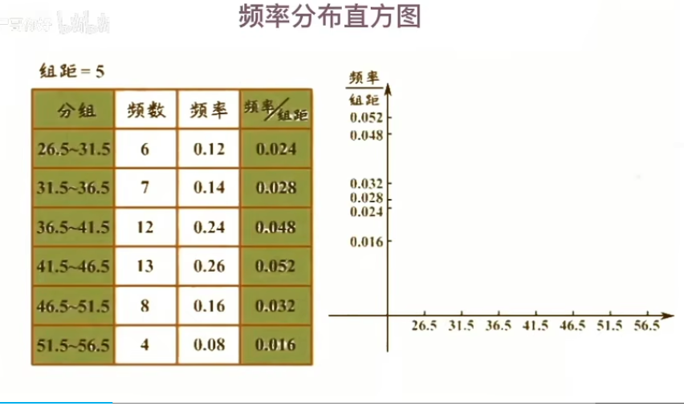
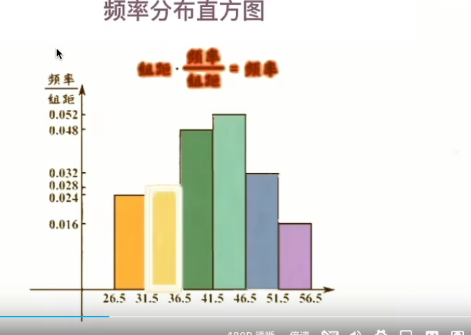
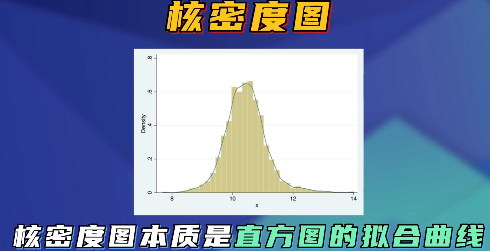
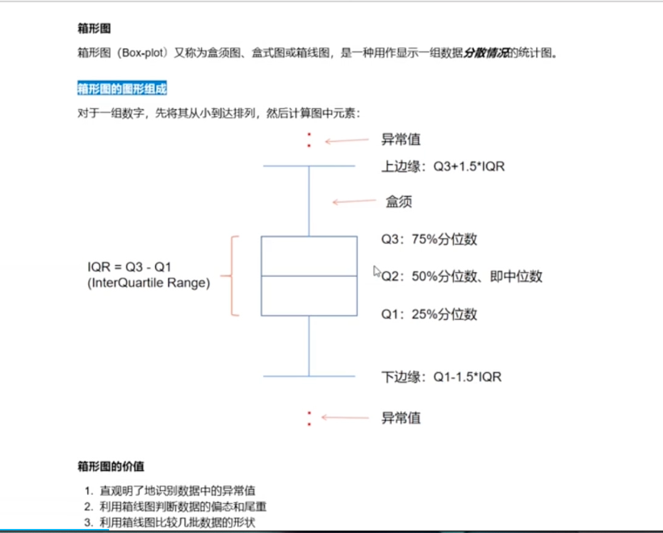
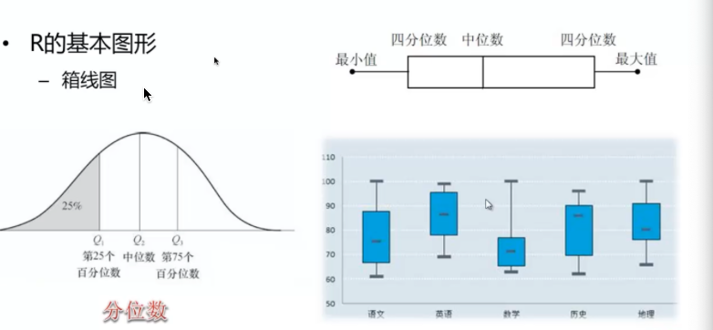

# R的基本图形

## 简单的条形图、堆砌、分组条形图、均值条形图、条形图微调

### 条形图

导入包vcd

```r
install.packages("grid")
install.packages("vcd")
library(vcd)

barplot(c(1,2,4,2,6,4,3,5))
barplot(c(1,2,4,2,6,4,3,5),horiz = TRUE) # horiz 条形图方向

```


```R
Arthritis  # vcd 自带的测试数据集
counts<-table(Arthritis$Improved)
counts
barplot(counts)
barplot(counts,horiz = TRUE)

```


```R
counts<-table(Arthritis$Improved,Arthritis$Treatment)
counts
barplot(counts) # 这个时候的条形图是重叠的(堆砌在一起了)
barplot(counts,beside = TRUE) # beside 设置图片不在堆砌
```


```R
# 两个自带的测试数据集
state.region
state.x77
states<-data.frame(state.region,state.x77)
states
x<-aggregate(states$Illiteracy,by=list(state.region),FUN=mean) #统计各区域的文盲平均值
x
barplot(x$x,names.arg = x$Group.1)
```


**条形图的微调**

使用par和cex函数

```R
# **条形图的微调**
par(mar=c(5,8,4,2))
counts<-table(Arthritis$Improved)
par(las=2)
barplot(counts,horiz = TRUE,cex.names = 0.8,names.arg = c("No improved"
                                                          ,"some improved"
                                                          ,"marked improved"))

```


### 饼图

pie函数 

```R
# 饼图
par(mfrow=c(2,2))
x<-c(10,12,4,16,8)
lab<-c("us","uk","australia","germany","france")
pie(x,lab,main = "Simple Pie Chart")


pct<-round(x/sum(x)*100)
pct
lab1<-paste(lab," ",pct,"%",sep = " ")
lab1
pie(x,lab1,col = rainbow(length(lab1)),main = "Pie Chart with Percentage")
# 3D   饼图
install.packages("plotrix")
library(plotrix)
pie3D(x,explode=0.1,main="3D Pie Chart")


```


### 扇形

```R
# 扇形
fan.plot(x,labels = lab,main = "Fan Pie")

```


### 直方图

hist函数





```R
# 直方图
x<-mtcars$mpg
x  
hist(x)  
hist(x,breaks = 12,col="red",xlab = "Mile per callon")  
hist(x,freq = FALSE,breaks = 12,col = "green",xlab = "Mile Per Callon") 
rug(jitter(x))  
lines(density(x),col="red",lwd=2)  
```


### 核密度图




```R

# 核密度图
x<-density(mtcars$mpg)
mtcars$mpg
x
plot(x)
# 比较不同的核密度图比较
#比较不同的核密度图比较
#使用sm包
attach(mtcars)
# install.packages("sm")
library(sm)
mpg
cyl
sm.density.compare(mpg,cyl,xlab="Mile per gallon")

```


### 箱线图







使用函数boxplot

```R
# 箱线图
boxplot(mtcars$mpg,main="Box plox",ylab="Miles per gallon")
boxplot(mpg~cyl,data = mtcars,main="Car mileage data",xlab="Number of cylinders"
        ,ylab = "miles per gallon")
```


