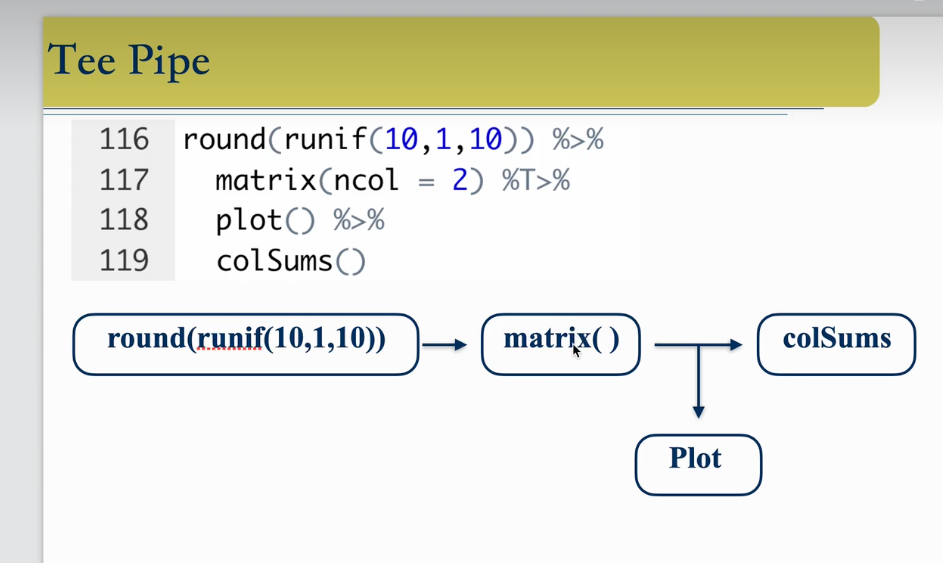

# 管道符 

```R
x<-runif(10,0,1)
x

round(sqrt(abs(log(x))),2)
# 相当于
install.packages("tidyverse")
library(tidyverse)

install.packages("dplyr")
library(dplyr)
x %>% log() %>% abs() %>% sqrt() %>%round(2)

# arrange 按那个字段类型排序
mtcars %>% filter(cyl==4) %>% select(mpg,wt) %>% arrange(wt)


# 点在管道符，代指前面一个数
pi %>% round(2)
2 %>% round(pi,.)
6 %>% round(pi,.)
paste(1:3,letters[1:3])
1:3 %>% paste(.,letters[.])r
```


## 解释管道符 

```R
# 解释管道符  %$%
install.packages("magrittr")
library(magrittr)

data(mtcars)

# 普通管道符是无法直接获取上一个值的数据框的数据，解释管道符可以
mtcars %>% cor(disp,mpg)
cor(mtcars$disp,mtcars$mpg)

mtcars %$% cor(disp,mpg)

```


## 赋值管道符


```r
# 赋值管道符
install.packages("mgrittr")
library(magrittr)

x<-1:5
x %>% sum()
x

x %<>% sum() 
x

# 经常用来给数据框添加字段 mutate() 添加字段函数
library(dplyr)
data<- mtcars %>% mutate(kpl=0.425*mpg)
data

mtcars %<>% mutate(kpl=0.425*mpg)
```


## T型管道符





```R
# T型管道符
library(magrittr)

round(runif(10,1,10)) %>% matrix(ncol = 2) %T>% plot() %>% colSums() 

```


```
dplyr是R中专门用于数据处理的包。更具体功能包括：

select() 从数据中选择列
filter() 数据行的子集
group_by() 汇总数据
summarise() 汇总数据（计算汇总统计信息）
arrange() 排序数据
mutate() 创建新变量
在大多数情况下，dplyr仅执行这些任务。dplyr出色的部分原因在于它“紧凑”。只有5或6种主要工具，并且非常易于使用。
```

