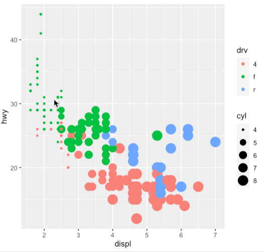
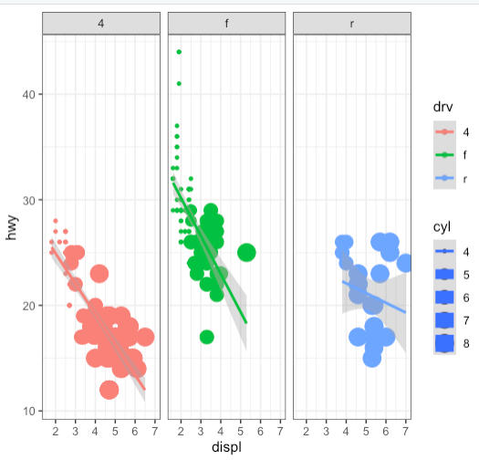
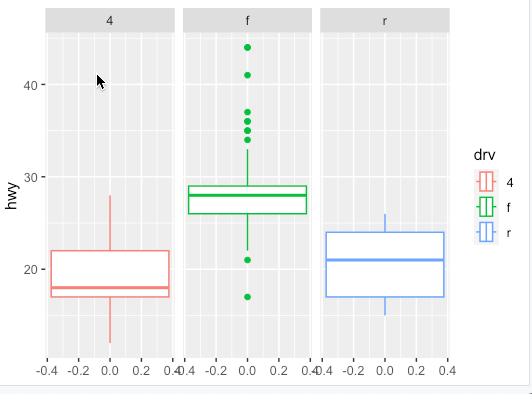
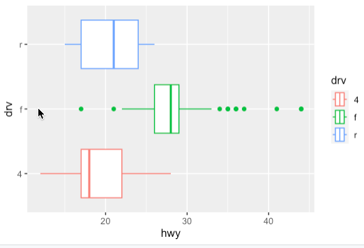
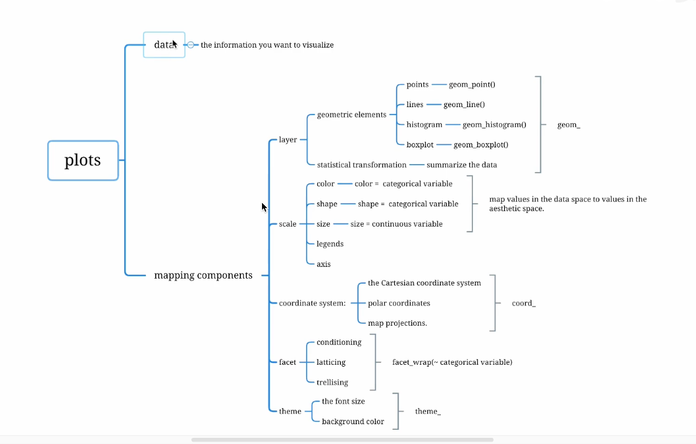
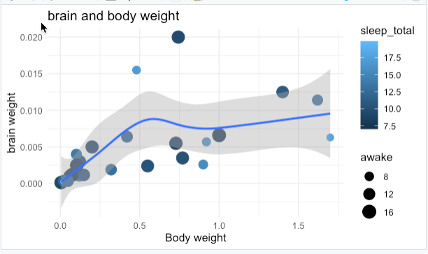

# ggplot2

```R
Package:tidyverse
- ggplot2,for data visualization
- dplyr,for data manipulation
- readr,for data import
- purr,for functional programming
- tibble,for tibbles,modern re-imagining of data frames.
- stringr for strings
- forcats,for factors
```


ggplot2的扩展包


https://exts.ggplot2.tidyverse.org/gallery/


```R
install.packages("ggplot2")
install.packages("tidyverse")

library(ggplot2)
library(tidyverse)

data(mpg)

ggplot(data = mpg,mapping = aes(x=displ,y=hwy,col=drv,size=cyl))+
  geom_point()

ggplot(mpg,aes(displ,hwy,size=cyl,col=drv))+
  geom_point()
```




```R
ggplot(mpg,aes(displ,hwy,size=cyl,col=drv))+
  geom_point()+
  geom_smooth(method = "lm")+
  facet_wrap(~drv)+
    theme_bw()
```





```R
ggplot(mpg,aes(hwy,col=drv))+
  geom_boxplot()+
  facet_wrap(~drv)+
  coord_flip()

```




```R
ggplot(mpg,aes(hwy,drv,col=drv))+
  geom_boxplot()
```







```R
# 使用自带的msleep数据集
data(msleep)
msleep
attach(msleep)


ggplot(data = msleep,mapping = aes(x=vore, y=awake))+
  geom_boxplot(colour=1,fill=5)

ggplot(msleep,aes(vore,awake))+
  geom_boxplot(colour=1,fill=6)

msleep %>% ggplot(aes(vore,awake))+
  geom_boxplot()+
  coord_flip()


# drop_na(vore) 剔除 vore==na 的个案
# drop_na() 剔除任何一个变量有缺失的个案
msleep %>% drop_na(vore) %>% 
  ggplot(aes(x=vore))+
  geom_bar(fill="6E5175")+
  coord_flip()+
  theme_bw()+
  labs(x="Who eats what",y="Freq",title("Number of  observations per order"))


# fac_infreq 排序
msleep %>% drop_na(vore) %>% 
  ggplot(aes(fct_infreq(vore)))+
  geom_bar(fill="red")+
  coord_flip()+
  theme_bw()+
  labs(x="Who eats what",y="Freq",title("Number of  observations per order"))


```


## 直方图

```R

# 直方图
data(mpg)

mpg %>% ggplot(aes(hwy))+
  geom_histogram()

mpg %>% ggplot(aes(hwy))+
  geom_histogram(binwidth = 5)

mpg %>% ggplot(aes(hwy))+
  geom_histogram(bins=10)

mpg %>% ggplot(aes(hwy,fill=drv))+
  geom_histogram(breaks=seq(10,45,3),col=1)+
  lims(x=c(5,50),y=c(0,60))
  labs(title = "Histogram of hwy",x="Highway miles per gallon")+
  scale_x_continuous(breaks = seq(10,50,3))+
  scale_y_continuous(breaks=seq(0,60,5))+
  theme_minimal()


mpg %>% ggplot(aes(hwy,fill=drv))+
  geom_histogram(breaks=seq(10,45,3),col=1)+
  lims(x=c(5,50),y=c(0,60))+
  facet_wrap(~drv,ncol=1)+
labs(title = "Histogram of hwy",x="Highway miles per gallon")+
  scale_x_continuous(breaks = seq(10,50,3))+
  scale_y_continuous(breaks=seq(0,60,10))+
  theme_minimal()


mpg %>% ggplot(aes(hwy,fill=class))+
  geom_histogram(breaks=seq(10,45,3),col=1)+
  facet_wrap(~class,ncol=3)+
  lims(x=c(5,50),y=c(0,60))+
  labs(title = "Histogram of hwy",x="Highway miles per gallon")+
  scale_x_continuous(breaks = seq(10,50,3))+
  scale_y_continuous(breaks=seq(0,60,10))+
  theme_minimal()

```


## 散点图


```R
# 散点图
msleep %>% drop_na(vore) %>% 
  ggplot(aes(sleep_total,bodywt,col=vore))+
  geom_point(size=3,alpha=0.5)+
  geom_line()

# facet_wrap切面
msleep %>% drop_na(vore) %>% 
  ggplot(aes(brainwt,bodywt))+
  geom_point(size=3,alpha=0.5)+
  geom_smooth(method = lm,se=F)+
  facet_wrap(~vore)+
  labs(title = "brain weight & bodyweight")+
  theme_gray()
```


如果是两个或者的更多的定量变量，如何展示

```R
# 如果是两个或者的更多的定量变量
# two or more numeric
msleep %>% filter(bodywt<2) %>% 
  ggplot(aes(bodywt,brainwt))+
  geom_point(aes(color=sleep_total,size=awake))+
  geom_smooth()+
  labs(x="Body weight",y="brain weight",title="brain and body weight")+
  theme_minimal()

```





颜色定义位置不同，效果不同

放在ggplot函数里面是对全部生效  ，单独放其他函数  ，只对该函数作用的数据范围有效


```R
# 颜色定义位置不同，效果不同
mpg %>% 
  ggplot(aes(displ,cty,color=drv))+
  geom_point()+
  geom_smooth(method = lm,se=F)


mpg %>% 
  ggplot(aes(displ,cty))+
  geom_point(aes(color=drv))+
  geom_smooth(method = lm,se=F)
```


```R
mpg %>% 
  ggplot(aes(displ,cty))+
  geom_point(aes(color=drv))+
  geom_smooth(method = lm,se=F)+
  theme_light()+
  theme(plot.title = element_text(face="bold",colour = "red"),
        axis.title = element_text(face="bold",colour="red"),
        axis.text = element_text(face="bold",colour="red"))


```


