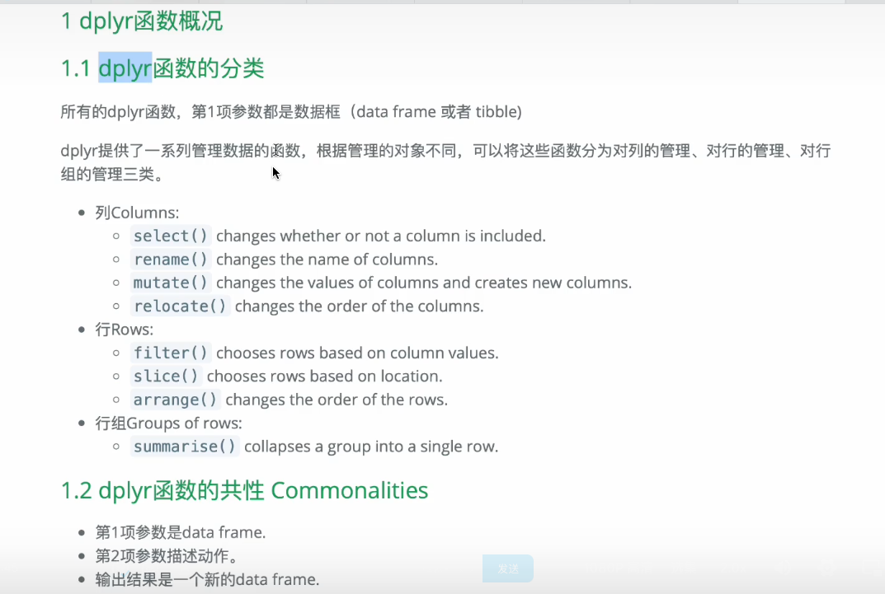

```
dplyr是R中专门用于数据处理的包。更具体功能包括：

select() 从数据中选择列
filter() 数据行的子集
group_by() 汇总数据
summarise() 汇总数据（计算汇总统计信息）
arrange() 排序数据
mutate() 创建新变量
在大多数情况下，dplyr仅执行这些任务。dplyr出色的部分原因在于它“紧凑”。只有5或6种主要工具，并且非常易于使用。
```


pivot_longer() 把行转成列

```R
library(tidyverse)
data(population)


# pivot_longer() 把行转成列
population<- read_excel("xxx.xlsx")
long<-population %>%  pivot_longer(cols = gz:bj,names_to = "city",values_to = "population")

long %>% ggplot(aes(year,population,col=city))+
  geom_point()+
  geom_smooth(method = "lm")+
  labs(title = "2000-2021年常住人口总数")+
  scale_color_discrete(labels=c("beijing","guangzhou","shanghai","shengzhen"))

```


# dplyr包




```R

# dplyr函数包
library(dplyr)
# select()
# 一下函数可以设置选择变量的条件
# contains()
# starts_with()
# ends_with()
# last_col()

# names() 列出数据框所有变量名
names(starwars)

# 选择需要的变量，创建新的数据框
data1<- starwars %>% select(name,height,mass,sex,species,films)
data1


# 选择范围，变量名1：变量名2
data2<-starwars %>% select(name:mass)
data2

data3<-starwars %>% select(1:6)
data3

#设置条件
data4<-starwars %>% select(name,species,contains("color"))
data4

# 对变量重新命名
data5<-data1 %>% select(name,height,weight=mass)
data5

# mutate
data1 %<>% mutate(BMI=mass/((height/100)^2)) %>% arrange(desc(BMI))
data1

# if_else()
data7<-data1 %>% drop_na(mass) %>% 
  mutate(weight_size=if_else(mass>100,"large","small"))
data7

# recode() overwrite the original variable
data8<-data7 %>% mutate(weight_size=recode(weight_size,"large"=1,"small"=2))
data8


# filter()
# 列出变量的取值种类
unique(starwars$species)

# 提取species===Droid 的个案
data9<-starwars %>% select(name,height,mass,sex,species) %>% 
  filter(species=="Droid") %>% 
  arrange(height)
data9

data9<-starwars %>% select(name,height,mass,sex,species) %>% 
  filter((species=="Human"|species=="Droid")&height<200) %>% 
  arrange(height)
data9

# 逗号分割多个提取条件
data9<-starwars %>% select(name,height,mass,sex,species) %>% 
  filter(height<200,species=="Human") %>% 
  arrange(height)
data9

# %in% 属于
data10<-starwars %>% 
  select(name,height,mass,sex,species) %>% 
  filter((species%in%c("Human","Droid"))&height<200) %>% 
  arrange(desc(height))
data10


# 去除空值
mean(starwars$height,na.rm = TRUE)

# 剔除任意一个变量有缺失值的个案，保留所有的变量都有值的个案
# 方法一： na.omit()
data1<-starwars %>% 
  select(name,gender,hair_color,height) %>% 
  na.omit()
data1


# 方法二: filter(complete.cases(.))
data2<-starwars %>% 
  select(name,gender,hair_color,height) %>% 
  filter(complete.cases(.))
data2

# 查看所有缺失值的个案 filter(!complete.cases(.))
data2<-starwars %>% 
  select(name,gender,hair_color,height) %>% 
  filter(!complete.cases(.))

# 方法三： drop_na()
data4<-starwars %>% 
  select(name,gender,hair_color,height) %>% 
  drop_na(height)


# 方法四：filter(!ia.na(height))
data5<-starwars %>% 
  select(name,gender,hair_color,height) %>% 
  filter(!is.na(height))


# 将缺失值NA替换成指定值
data6<-starwars %>% 
  select(name,gender,hair_color,height) %>% 
  mutate(hair_color=replace_na(hair_color,"none")) %>% 
  filter(complete.cases(.))
```


