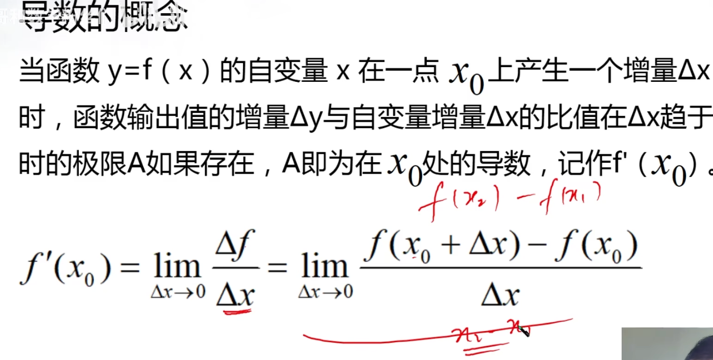
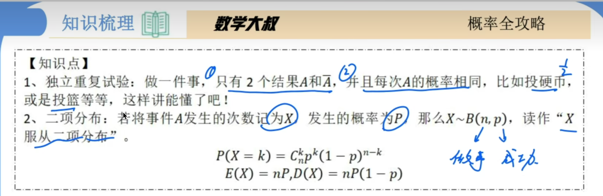
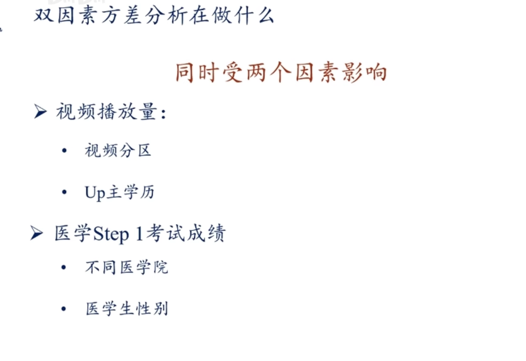

# 1.简单抽样

#### 抽样调查

根据一定目的，从总体中抽取一部分个体进行调查，井!以此为依据对总体的情况作出估计和推断的调查方法，**称为抽样调查•**

- 我们把从总体中抽取的那部分个体称为**样本**，样本中包含的个数称为**样本量**.
- 调查样本获得的变量值称为样本的观测数据，简称**样本数据**

​      一般地，设一个总体含有N（N为正整数）个体，从中逐个抽服n(1<=n＜M) 个个体作为样本，如果抽取是放回的，且每次抽取时总体内的各个个体被抽到的概率都相等，
我们把这样的抽样方法叫做**放回简单随机抽样**； 

​      如果抽取时不放回的，旦每次抽取时总体内未进入样本的各个个体被抽到的概率都相等，
我们把这样的抽样方法叫做**不放回简单随机抽样**。
放回简单随机抽样和不放回简单随机抽样统称为简单随机抽样（除非特殊声明，均指不放回简单随机抽样）。
通过简单随机抽样获得的样本称为简单随机样本。
注：从总体中，逐个不放回地随机抽取n个个体作为样本，
一次性批量随机抽取n个个体作为样本，两种方法是等价的。

**简单随机抽样的特点**

- 总体个数有限.
- 从总体中逐个进行抽取。
- 是一种不放回抽样。
- 是一种等可抽样。

 **抽签法：**适用于总体中个数不多的情形.
1.把总体中N个个体**编号**，例如按1~N进行编号．
2.把编号写在**外观、质地等无差别**的小纸片（也可以是卡片、小球等)上作为号签.
将这些小纸片放在一个不透明的盒里，充分搅拌 

3.从盒中不放回地逐个抽取号签，使与号签上的编号**对应的个体**进入样本，
直到抽足**样本所需要的个数**。

**随机数法**

1.把总体中的N个个体依次编上0，1，…，N-1的号码。
2.然后利用工具（转盘、摸球、随机数表、科学计算器或计算机等）产生0，1.…，N-1中的随机数。
产生的随机数是几，就选几号个体。
3.重复上述过程，直至抽到预先规定的样本数。 一个总体共有60个个体，其编号为00，01，02，….59，现从中抽取一个容量为10的样本， 请从随机数表的第8行第11列的数字开始，向右读，到最后一列后再从下一行的左边开始继续向右读，依次获取样本号码，直到取满样本为止，则获得的样本号码是_____________________________________________________

**总体均值**

**样本均值**

# 2.随机抽样

**分层随机抽样的概念**

​		分层随机抽样的概念 一般地，按一个或多个变量把总体划分成若干个子总体，每个个体属于且仅属于一个子总体， 在每个子总体中独立地进行简单随机抽祥，再把所有子总体中抽取的样本合在一起作为总样本， 这样的抽样方法称为分层随机抽样，每一个子总体称为层。在分层随机抽样中，如果每层样本量都与层的大小成比例，那么称这种样本量的分配方式为比例分配。

# 3.用样本估计总体

### 频率直方图

组距是自己根据样本容量随机定的

### 条形统计图

### 	扇形统计图

### 折线统计图

**条形统计图一优点：**适用于描述离散型的数据，直观描述不同类别或分组数据的频数和频率，
缺点：不能显示出部分与整体的关系
**扇形统计圈一特点**：

​		1.圆代表总体为1，扇形代表总体中的不同部分（其和为1）；
​		2.直观描述各类数据占总数的比例。
**折线统计图--特点：**用于描述数据随时间的变化趋势。
**频率直方图—优点**：适用描述连续型数据，直观描述不同类别或分组数据的频数和频率，

### 总体百分位估计

## 众数、中位数、平均数的概念

### 总体趋势估计

### 平均距离

# 方差

# 标准差

# 方差标准差应用

# 分层抽样的方差

# 导数：

# 方差、协方差、期望的作用

# 方差和[协方差](https://so.csdn.net/so/search?q=协方差&spm=1001.2101.3001.7020)

  

在统计学中，方差是用来度量单个随机变量的离散程度，而协方差一般是用来度量两个随机变量的相似程度，其中方差的计算公式为：

  其中，n nn表示样本总量，符号x ˉ \bar{x}xˉ表示观测样本的均值。并且分母除以n − 1 n-1n−1表示无偏估计。

  在此基础上，协方差公式被定义为：

1. 方差用于反应数据的离散程度，期望用于反应数据的聚合情况

## 期望和方程的一些公式

期望指的是一个平均数

方差指的是偏离平均数的一个离散程度

统计图，越往中间走方差越小，越往两边走方差越大

# 回归方程

# 二项分布

二项分布的特定：

# 超几何分布

**超几何分布特点**

# 正态分布

## 正态分布标准化和z值

求中国人寿命超过81岁的概率：

寿命分布：u1（期望）=80    a1（方差）=0.5

z=x-u/a   81-80/0.5=2

也就是z=2；在标准正太分布表上找到2的面积对于的表面积0.9772

# 一元线性方程：

# 残差和R平方

## R平方

回归:现有和以后出现的数据都会趋向于一个值。

拟合:根据现有数据，找出一个最接近的函数，不关心以后的数据。

以下是我个人的理解

从离散点的角度看，它们都有靠近某条曲线的趋势，所以这些点都在朝曲线拟合

从曲线的角度看，那些离散的都在向自己靠拢，所以这些点都在回归到曲线

所以拟合表示离散点与某个曲线方程的偏差小，回归表示如何找到这样的曲线方程

比如春节，在外打工的人都在朝回家的地方拟合，在家的人看来这些人都在回家。

# 非线性方程

线性的散点图是拟合一条直线；

非线性是一条曲线。一般有线性来推出来，有平方和对数等。

# 卡方分布

正太分布平方求和。

# T分布

**样本小的时候，用t分布容错率小一些**

# t检验

公式

一般显著性水平设置0.05

自由度：n1+n2-2

如果：

# 方差分析

## 单因素方差分析

不同分组之间他们的均值是否存在显著的差异，通常来说这个组它是要大于等于三组的，如果是两组，也就是他们之间的均值是否相等的时候，我们是直接使用t检验就可以了。当我们的组别大于等于三的时候。我们就要使用方差分析。方差分析就是t检验的延伸

单因素分析： 分类和特征值

**方差分析的思路**

**方差分析中的计算**

整体波动sst

组内波动ssw

**组间波动**

 构造一个统计量，来判断我们的组间波动是不是足够的大。大到让我们拒绝我们的原假设。也就是各个组件他们的均值是相等的。那我们来看下这个f统计量是怎么构造的：

自由度：

计算某个指标是所使用的能够贡献信息的个体数量：

p值需要去查表

 

方差分析他是在比较不同组别之间的平均值，那这里我们组别要至少有三组，方差分析的思路，就是通过我们数据的波动具体是由于组间波动造成的，还是由于组内波动造成的，那如果我们发现各个组之间他的组间波动比较大的话，那我们就有理由认为我们组间的平均值它不相等的概率比较大。这就是方差分析的思路。

## 双因素方差分析

双因素方差分析：根据两个因素进行分组之后，探讨不同分组之间均值是否相等。

**双因素分析计算**

整体波动

第一个因素波动

女生都取女生平均值，男生都取男生平均值

第二个因素波动：

取各自学校平均值

交互项的波动:

各取平局值

得到模型的波动

**误差项的波动**

自由度：

根据这个f统计量，取查表，如果p值它小于0.05的话，那我们说因素显著的影响我的特征值。如果大于就是没有显著影响。

使用软件返回结果

