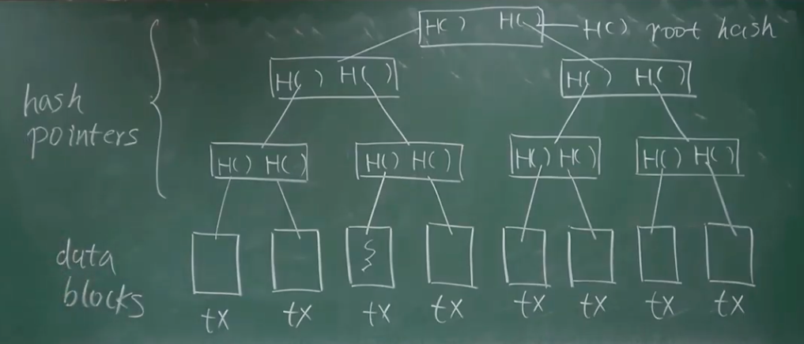
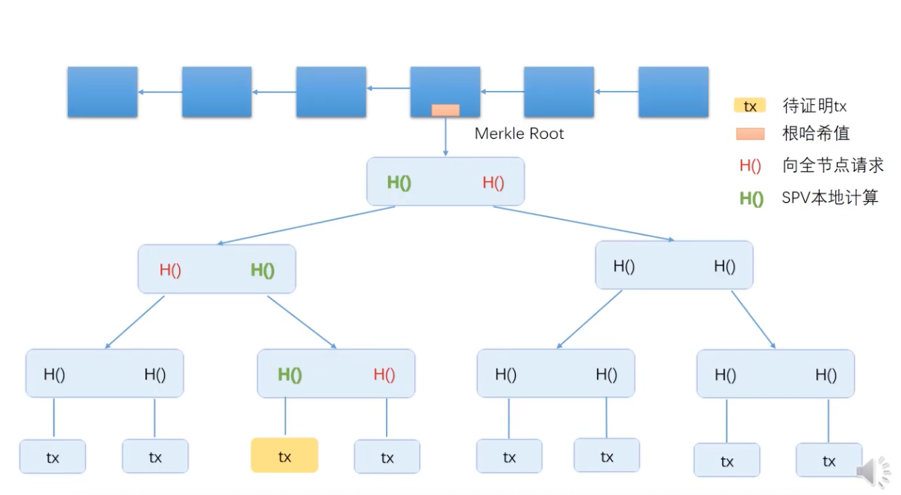

btc 的数据结构一个重要的概念哈希指针

hash pointers

## Hash pinters

区块链：一个一个的区块组成的链表

Block chain is a linked list using hash pointers

Genesis block第一个区块

most recent block最近生成的区块，每个区块都包含一个指向上一个区块的hash指针，除了第一个区块

hash值是通过它之前全部区块算出来得值，比如有人修改了链表中的快区块的内容，那么它后面的区块的hash都会影响。

Tamper-evident-log

区块链是牵一发而动全身的。只要记住最后一个区块的hash值，就能检查出链表中任何位置的修改

## merkle tree

merkle  tree和binary tree  区别：使用了hash指针代替了普通指针

比特币中每个区块实际上是一个一个的交易，分为block header 和 block body

Block header 保存hash值，block body保存交易的列表

**merkle  proof**： 用来证明节点是包含在区块链里面的，比如手机端是个轻节点只有block header没有block body，也就是没有交易流水，那么我们用手机端支付交易的时候，要如何证明，这笔交易被记录到区块链上去了。这里就需要用到merkle proof来查询验证。

如图，比如我们轻节点黄色交易tx发生在手机端的轻节点，如何证明，轻节点向全节点发送请求，全节点返回交易链上绿色hash值，然后轻节点拿到这些链上hash值算出最终的根节点hash值，再拿这个hash值和全节点hash值比较，如果相等，就证明这笔交易被放到链上了。

