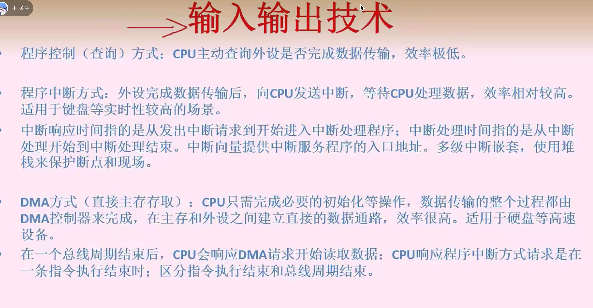

# 操作系统：存储、文件、设备、磁盘管理

**页内地址是n位就可以表示2的n次方大小**

## 电脑中存储常用的单位：

1Byte(Byte 字节) = 8Bit

1KB (Kilobyte 千字节) = 1024Byte，

1MB (Megabyte，兆字节，简称“兆”) = 1024KB，

1GB (Gigabyte，吉字节，又称“千兆”) = 1024MB

k在计算机上代表1024，因为计算机是二进制的，在其他跟数有关的地方代表千，因为是十进制的，两者的差别不大。2的12次方是4096，就可以认为是4k了

**页内地址是n位就可以表示2的n次方大小**

4k是2的12次方；所以页内地址是12位，十二位的2进制正好是3位十六进制(每4位2进制表示一位16进制)。

所以1D16H中的D16H就是页内偏移，页内偏移的逻辑地址和物理地址是相同的。那么由表高位的1对应物理地址是3，那么变换后的物理地址是3D16H

## 快表

## 段式存储管理

# 文件管理

## 设备管理

层次结构：背

重点：

## 磁盘

 

# 微内核操作系统

