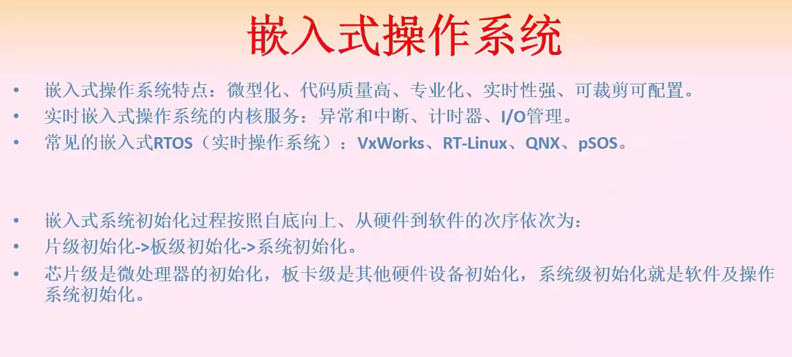

# 操作系统：存储、文件、设备、磁盘管理

进程空间都是逻辑地址，实际上内存里面是物理空间，物理空间的大小和页的大小是一样的

进程空间是页。物理空间是页帧号

页：页号+页内地址(页内偏移)      页地址多少位就能表示2的多少次方大小

考点：物理地址和逻辑地址的转换，转换中页内偏移是不变的，只有页号和物理块号(物理块号一般给出页表让你通过页号去查)会变。页内地址就是表示这个页的大小，页号表示的是一共有多少个页。

**页内地址是n位就可以表示2的n次方大小**

## 电脑中存储常用的单位：

1Byte(Byte 字节) = 8Bit

1KB (Kilobyte 千字节) = 1024Byte，

1MB (Megabyte，兆字节，简称“兆”) = 1024KB，

1GB (Gigabyte，吉字节，又称“千兆”) = 1024MB

k在计算机上代表1024，因为计算机是二进制的，在其他跟数有关的地方代表千，因为是十进制的，两者的差别不大。2的12次方是4096，就可以认为是4k了

**页内地址是n位就可以表示2的n次方大小**

4k是2的12次方；所以页内偏移占了是12位，十二位的2进制正好是3位十六进制(每4位2进制表示一位16进制)。

所以1D16H中的D16H就是页内偏移，页内偏移的逻辑地址和物理地址是相同的。那么由表高位的1对应物理地址是3，那么变换后的物理地址是3D16H

逻辑页号对应物理块号

页内地址及逻辑地址（页内偏移）对应物理空间（页帧号）

## 快表

页表和页都在内存里面

慢表：访问内存查到页表，去除页表对应的物理块地址，组成物理地址，再去内存访问页；就会访问两次内存

快表：是访问一次cache，和访问一次内存，所以比慢表快。

## 段式存储管理

和页式比较：页式大小固定，段式是根据逻辑来分配大小，大小固定。

上图，比如段长是30k，基址是40k；也就是这个段在内存空间第40k的地方开始，长度30k；就是40k到70k这一段的内存空间。

# 文件管理

 

磁盘块号是从0开始的数的

**位（Bit）** ：表示一个二进制数码0或1，是计算机存储处理信息的最基本 的单位。

**字节（Byte）** ：一个字节由8个位组成 。它表示作为一个完整处理单位的8个二进制数码。现目前计算机上多使用《美国国家信息交换标准代码》——ASCII编码（由美国国家标准委员会制定）

                 如：字符“A”的二进制编码是“0100 0001”即41H或65D
    
                             “#”的二进制编码是“0010 0011”即23H或35D

**字（Word）** ：16个位为一个字（即两个字节是一个字） ，它代表计算机处理指令或数据的二进制数位数，是计算机进行数据存储和数据处理的运算单位。通常称16位是一个字，32位是一个双字，64位是两个双字。

 

**字长：**字的位数叫做字长。，不同档次的机器有不同的字长。例如一台8位机，它的1个字就等于1个字节，字长为8位。如果是一台16位机，它的1个字就由2个字节构成，字长为16位。

 

字节和字长的区别：由于常用的英文字符用8位二进制就可以表示，所以通常就将8位称为一个字节。字长的长度是不固定的，对于不同的CPU、字长的长度也不一样。8位的CPU一次只能处理一个字节，而32位的CPU一次就能处理4个字节，同理字长为64位的CPU一次可以处理8个字节。

每一个物理块在位式图用一位表示。 

## 设备管理

层次结构：背

重点：

程序查询:只能串行，效率慢

中断方式DMA都可以并行

d

## 磁盘

 

# 微内核操作系统

