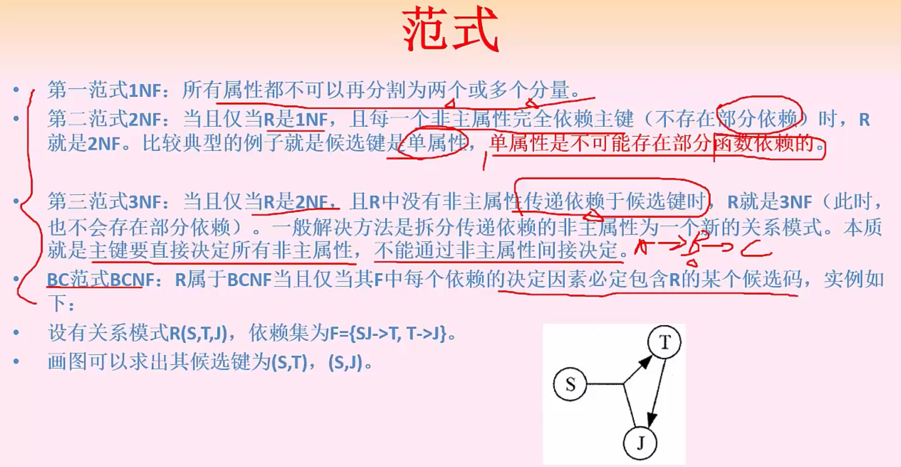

# 数据库

## 数据库的设计：

## er模型

## 关系模型

选B

## 关系代数运算

笛卡尔积用 X 表示

投影用 π 表示  **π**1,2（s1）

选择用 ρ 表示 **ρ**sno=No0003

选D

## 函数依赖

超键：比如员工号能表是员工；那么所有其他属性和员工号组合的属性都能表示员工号。员工号可以做超建

## 范式

1.找候选键，候选键可以是多个，由于只要在候选键里面的都是主属性。

****

范式的级别越高，说明表的效率越高，冗余比较低

两个关系模式直接用公式推

R1-R2  就是R1有R2没有的值

R1交R2等于R1-R2=A,B,E   R2-R1=D  而c既不能推出ABE也不能推出D，所以是有损分解

函数依赖：

看模式R1和R2符合 F不

从R1中看出B->A符合，D->A在R1和R2中都没有，不符合

